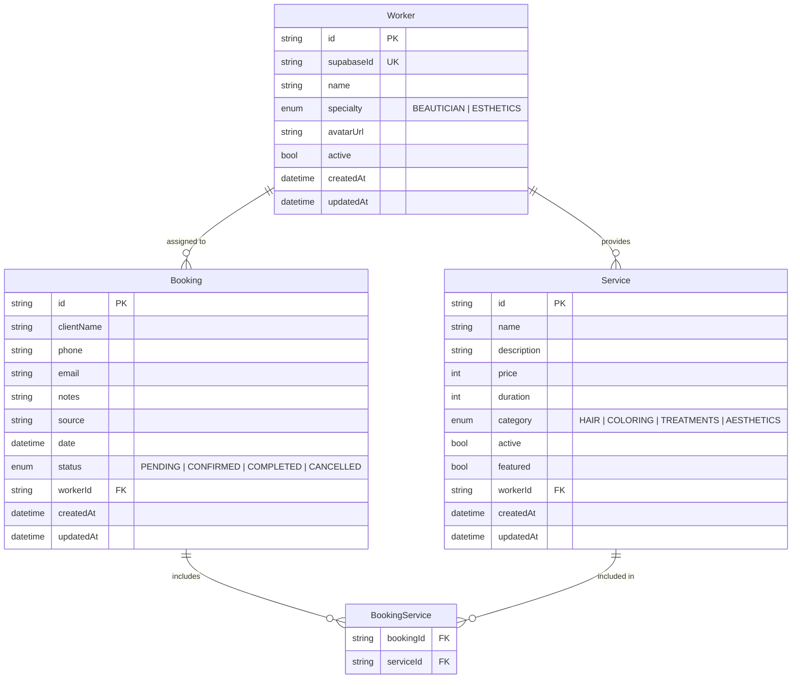

# Barbershop

> Full-stack appointment and management system for a barbershop/beauty salon.

A personal project built for my stepmother's barbershop business. Customers can book appointments online; staff manage bookings, services, and workers through a dedicated dashboard.

---

## Architecture

```
┌─────────────────────────────────────────────────────────────┐
│                        Browser                              │
│                                                             │
│   ┌─────────────────────────────────────────────────────┐   │
│   │            Angular 21 (web/)                        │   │
│   │   Public site + booking form  │  Admin dashboard    │   │
│   └────────────────────┬────────────────────────────────┘   │
└────────────────────────┼────────────────────────────────────┘
                         │ HTTP / REST
┌────────────────────────▼────────────────────────────────────┐
│                   NestJS 11 (api/)                          │
│                                                             │
│          Workers  │  Services  │  Bookings                  │
│                                                             │
│     Supabase Auth (JWT)  │  Swagger + Scalar docs           │
└────────────────────────┬────────────────────────────────────┘
                         │ Prisma 7 (ORM)
┌────────────────────────▼────────────────────────────────────┐
│              PostgreSQL — Neon (serverless)                 │
│                                                             │
│       Worker · Service · Booking · BookingService           │
└─────────────────────────────────────────────────────────────┘
                         │
┌────────────────────────▼────────────────────────────────────┐
│                    Supabase                                 │
│              Auth · JWT · User management                   │
└─────────────────────────────────────────────────────────────┘
```

---

## Monorepo Structure

```
barbershop/
├── api/          # NestJS REST API
│   ├── src/
│   │   ├── common/        # Guards, strategies, decorators
│   │   ├── modules/       # booking · service · worker
│   │   ├── prisma/        # PrismaService
│   │   └── supabase/      # Supabase client module
│   └── README.md
│
├── web/          # Angular 21 frontend
│   ├── src/
│   │   └── app/           # Standalone components, routes
│   └── README.md
│
└── prisma/       # Shared DB schema & migrations
    └── schema.prisma
```

---

## Tech Stack

### Backend (`api/`)

| | |
|---|---|
| Framework | NestJS 11 |
| Language | TypeScript 5.7 |
| ORM | Prisma 7 |
| Database | PostgreSQL (Neon serverless) |
| Auth | Supabase JWT + Passport.js |
| Docs | Swagger / Scalar |
| Testing | Jest 30 |
| Linter | Biome |

### Frontend (`web/`)

| | |
|---|---|
| Framework | Angular 21 (standalone) |
| Language | TypeScript 5.9 |
| Styling | Tailwind CSS 4 |
| Testing | Vitest 4 |
| Linter | Biome |

---

## Features

### Public (no login required)
- View all services with pricing and duration
- Browse featured / highlighted services
- Book an appointment by selecting a service, worker, and time slot

### Admin (authenticated)
- **Bookings** — view, filter, confirm, cancel, and delete bookings
- **Services** — create and manage services per worker, toggle featured
- **Workers** — manage staff profiles and specialties

---

## Data Model



---

## Getting Started

### Prerequisites

- Node.js 20+
- PostgreSQL (or a [Neon](https://neon.tech) project)
- A [Supabase](https://supabase.com) project for auth

### API

```bash
cd api
npm install
cp .env.example .env   # fill in DATABASE_URL, SUPABASE_URL, SUPABASE_ANON_KEY
npm run dev            # http://localhost:3000
```

### Web

```bash
cd web
npm install
npm start              # http://localhost:4200
```

---

## Scripts

| Location | Command | Description |
|---|---|---|
| `api/` | `npm run dev` | API dev server (watch) |
| `api/` | `npm test` | Unit tests |
| `api/` | `npm run test:e2e` | E2E tests |
| `web/` | `npm start` | Angular dev server |
| `web/` | `npm test` | Vitest tests |
| both | `npm run lint` | Biome lint |
| both | `npm run format` | Biome format |

---

## API Reference

Full docs available when the API is running:

- **Swagger UI** — `http://localhost:3000/api`
- **Scalar Reference** — `http://localhost:3000/docs`
